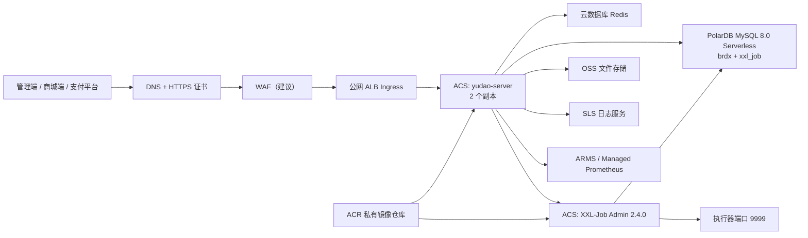

# yudao-cloud 阿里云 ACS 单体部署方案

## 1. 目标与范围

本文用于将 `feature/brdx` 分支的后端部署到阿里云容器计算服务 ACS。部署形态固定为一个 `yudao-server` 单体应用，不部署 `yudao-gateway`、Nacos 或各模块独立服务。

本次单体包包含以下模块：

- `system`、`infra`
- `member`、`pay`
- `product`、`promotion`、`trade`、`statistics`

本文覆盖后端、MySQL、Redis、XXL-Job、镜像仓库、入口、日志监控、发布和回滚。管理端及商城前端不在本文范围内。

## 2. 已确认的代码基线

| 项目 | 当前结论 |
| --- | --- |
| 代码基线 | `master-jdk17`，工作分支 `feature/brdx` |
| Java 字节码 | Java 17，class major version 61 |
| 单体入口 | `cn.iocoder.yudao.server.YudaoServerApplication` |
| 服务端口 | `48080` |
| 单体构建 | 41 个 Maven reactor 模块构建成功 |
| 单体模块 | 8 个目标 `*-server` JAR 已进入 `BOOT-INF/lib` |
| 主数据库脚本 | `db/yudao.sql`，122 张不重复表 |
| 调度数据库脚本 | `db/xxl_job.sql`，XXL-Job 2.4.0，8 张表 |
| 服务发现 | `yudao-server` 已禁用 Nacos，不需要注册中心 |

静态核对结果：代码中 120 个 `@TableName` 映射均能在 `db/yudao.sql` 找到；另外两张表是 `infra_job` 和 `infra_job_log`。这只能证明表名覆盖，列结构兼容性仍必须通过预发环境完整启动和核心链路测试确认。

## 3. 总体架构



核心原则：

- ACS、PolarDB、Redis、ACR 企业版私网地址部署在同一 VPC。
- 应用只通过 ALB 暴露 `48080`，PolarDB、Redis、XXL-Job Admin 不开放公网。
- 文件上传使用 OSS，不保存到 Pod 本地磁盘。
- 普通日志输出到标准输出并采集到 SLS；XXL-Job 执行器日志使用 NAS 持久化。
- Nacos、Spring Cloud Gateway、RocketMQ、RabbitMQ 和 Kafka 不作为本方案的必选依赖。

## 4. 建议资源规格

以下是上线初期基线，压测后再调整。

| 资源 | 测试环境 | 生产起步 | 说明 |
| --- | --- | --- | --- |
| `yudao-server` | 1 副本，2 vCPU / 4 GiB | 2 副本，单副本 4 vCPU / 4 GiB | ACS 中 requests 与 limits 均设为 4 vCPU / 4 GiB |
| XXL-Job Admin | 1 副本，1 vCPU / 2 GiB | 2 副本，单副本 2 vCPU / 2 GiB | ACS 中 requests 与 limits 均设为 2 vCPU / 2 GiB |
| PolarDB MySQL Serverless | 1-4 PCU | 2-8 PCU，生产最低 2 PCU | 同一集群创建两个数据库，存储自动扩容 |
| Redis | 1 GiB | 主从版 2 GiB 起 | 用于缓存、锁、验证码和跨实例 WebSocket |
| NAS | 可选 | 20 GiB 起 | 仅保存 XXL-Job executor 日志 |
| ACR | 个人版可用于测试 | 企业版基础实例 | 启用镜像扫描和私网访问 |
| ALB | 1 个 | 1 个，多可用区 | 开启 HTTPS 和 WebSocket |

应用连接池上限为每副本 20。若 HPA 最大副本数设为 6，PolarDB 最大 PCU 对应的连接容量必须覆盖至少 120 个应用连接，并为 XXL-Job、运维和迁移任务额外保留容量。

PolarDB Serverless 建议参数：

- 数据库引擎选择 PolarDB for MySQL 8.0，部署在至少两个可用区。
- 生产 PCU 范围以 `2-8 PCU` 起步，压测后调整上限；最低 PCU 不低于 2。
- 若控制台提供“无活动暂停”能力，生产环境关闭，避免首个请求承担集群恢复延迟。
- `master` 数据源使用主地址，或使用已设置为强一致性的集群地址；不要把只读地址配置为主数据源。
- `brdx` 与 `xxl_job` 使用同一集群的两个数据库，但使用独立账号和权限。
- 关注长连接对缩容的影响。连接池初始连接和最小空闲连接从 2 起步，最大连接仍为 20，并结合实际并发压测。

## 5. 上线前门禁

以下事项未完成前，不进入生产发布：

1. 将 `yudao-server/Dockerfile` 的基础镜像从 `eclipse-temurin:21-jre` 改为经过内部验证的 Temurin 17 JRE 镜像。
2. 在 JDK 17 构建环境重新执行 Maven 构建。当前本地结果是用 JDK 21 编译为 Java 17 字节码，生产流水线应使用真实 JDK 17。
3. 新增独立的 `application-prod.yaml`，生产环境禁止加载默认的 `local` 或 `dev` Profile。
4. 所有数据库密码、Redis 密码、XXL-Job token、支付密钥和第三方密钥进入阿里云 KMS/凭据管家或 Kubernetes Secret，不写入 Git、镜像和 ConfigMap。
5. 清理或确认初始化 SQL 中的演示账号、会员、订单和支付记录，修改默认管理员密码。
6. 修改 XXL-Job 默认管理员密码，`default_token` 必须替换为随机高强度 token。
7. 禁止公网访问 Swagger、Knife4j、Druid、Actuator 明细和 XXL-Job Admin。
8. 在预发 PolarDB Serverless 集群执行一次全新导入，并完成启动、下单、支付、退款、任务调度和 WebSocket 测试。
9. 处理 Maven 构建时出现的 `captcha-1.4.0.jar` SHA-1 不一致告警，生产构建只允许从可信制品仓库拉取依赖。

## 6. 生产配置方案

创建 `application-prod.yaml`，通过 ConfigMap 挂载到容器 `/yudao-server/config/application-prod.yaml`。敏感值仅通过 Secret 注入的环境变量引用。

建议配置骨架如下：

```yaml
server:
  port: 48080
  shutdown: graceful

spring:
  lifecycle:
    timeout-per-shutdown-phase: 30s
  datasource:
    druid:
      stat-view-servlet:
        enabled: false
    dynamic:
      primary: master
      strict: true
      druid:
        initial-size: 2
        min-idle: 2
        max-active: 20
      datasource:
        master:
          url: ${DB_URL}
          username: ${DB_USERNAME}
          password: ${DB_PASSWORD}
  data:
    redis:
      host: ${REDIS_HOST}
      port: ${REDIS_PORT:6379}
      database: ${REDIS_DATABASE:0}
      password: ${REDIS_PASSWORD}

xxl:
  job:
    enabled: true
    accessToken: ${XXL_JOB_ACCESS_TOKEN}
    admin:
      addresses: http://xxl-job-admin:8080/xxl-job-admin
    executor:
      appname: yudao-server
      port: 9999
      logpath: /var/log/yudao/xxl-job/yudao-server
      log-retention-days: 30

management:
  endpoints:
    web:
      base-path: /actuator
      exposure:
        include: health,info,prometheus
  endpoint:
    health:
      probes:
        enabled: true
      show-details: never

springdoc:
  api-docs:
    enabled: false
  swagger-ui:
    enabled: false

knife4j:
  enable: false

yudao:
  captcha:
    enable: true
  security:
    mock-enable: false
    permit-all-urls:
      - /admin-api/mp/open/**
      - /actuator/health/**
  websocket:
    sender-type: redis
  web:
    admin-ui:
      url: ${ADMIN_UI_URL}
  pay:
    order-notify-url: ${PUBLIC_API_URL}/admin-api/pay/notify/order
    refund-notify-url: ${PUBLIC_API_URL}/admin-api/pay/notify/refund
    transfer-notify-url: ${PUBLIC_API_URL}/admin-api/pay/notify/transfer
```

配置注意事项：

- `DB_URL` 指向 PolarDB 内网主地址或强一致集群地址，以及 `brdx` 数据库；保留 `serverTimezone=Asia/Shanghai`、`nullCatalogMeansCurrent=true`、`rewriteBatchedStatements=true` 等现有 JDBC 参数。
- PolarDB 与 Redis 启用 TLS 时，将 CA 和客户端参数纳入镜像或 Secret 挂载，并在预发验证证书更新流程。
- 多副本必须把 WebSocket `sender-type` 从 `local` 改为 `redis`，否则消息只能到达当前 Pod 的连接。
- XXL-Job executor 使用固定端口 `9999`，不要使用随机端口；XXL-Job Admin 需要能访问每个应用 Pod 的该端口。
- 支付回调域名必须是公网 HTTPS 域名，并在支付宝、微信等渠道后台配置一致的回调地址。

## 7. 数据库初始化

### 7.1 创建数据库

使用 PolarDB 高权限初始化账号创建两个数据库：

```sql
CREATE DATABASE `brdx`
  DEFAULT CHARACTER SET utf8mb4
  COLLATE utf8mb4_unicode_ci;

CREATE DATABASE `xxl_job`
  DEFAULT CHARACTER SET utf8mb4
  COLLATE utf8mb4_unicode_ci;
```

应用运行账号只授权 `brdx` 所需的 DML 权限；XXL-Job Admin 使用独立账号访问 `xxl_job`。初始化账号不提供给应用容器。应用和 XXL-Job 均使用 PolarDB 内网端点，不使用公网地址。

### 7.2 导入顺序

1. 将 `db/yudao.sql` 导入 `brdx`。
2. 将 `db/xxl_job.sql` 导入 `xxl_job`。脚本自身包含创建和切换数据库语句，执行账号需要对应权限。
3. 导入后执行对象数量核对。

```sql
SELECT table_schema, COUNT(*) AS table_count
FROM information_schema.tables
WHERE table_schema IN ('brdx', 'xxl_job')
GROUP BY table_schema;
```

全新初始化的预期结果：

| Schema | 表数量 |
| --- | ---: |
| `brdx` | 122 |
| `xxl_job` | 8 |

`db/yudao.sql` 含 `DROP TABLE IF EXISTS`，只用于全新环境初始化。已有业务数据的数据库禁止重复执行；后续结构变更必须使用单独、带版本号、可审计的增量 SQL。

### 7.3 上线前数据处理

- 删除不需要的演示会员、订单、支付和统计记录。
- 修改系统管理员、XXL-Job 管理员等默认密码。
- 检查租户、支付应用、支付渠道、短信、邮件、文件存储配置。
- 为 PolarDB 开启自动备份和时间点恢复，首次上线前创建一次手工备份并验证恢复到新集群的流程。

## 8. 构建与镜像发布

### 8.1 构建单体 JAR

CI 构建节点固定使用 JDK 17 和 Maven 3.8+：

```bash
java -version
mvn clean package -am -pl yudao-server -Dmaven.test.skip=true
unzip -t yudao-server/target/yudao-server.jar
```

正式流水线应在打包前单独执行项目测试和依赖安全扫描。镜像必须使用不可变标签，例如 Git commit SHA，不使用 `latest` 作为生产发布标识。

### 8.2 构建 Linux 镜像

开发机为 ARM Mac，而生产 ACS 通常选择 AMD64，因此显式指定目标平台：

```bash
export ACR_REGISTRY='<实例名称>-registry.cn-<region>.cr.aliyuncs.com'
export ACR_NAMESPACE='<命名空间>'
export IMAGE_TAG="$(git rev-parse --short=12 HEAD)"

docker buildx build \
  --platform linux/amd64 \
  -f yudao-server/Dockerfile \
  -t "${ACR_REGISTRY}/${ACR_NAMESPACE}/yudao-server:${IMAGE_TAG}" \
  --push \
  yudao-server
```

发布前验证镜像：

- 容器中的 `java -version` 必须为 17。
- 镜像扫描无高危、严重漏洞。
- 镜像内不包含 `application-local.yaml` 中的生产密钥覆盖文件。
- 记录镜像 digest，ACS Deployment 使用 digest 或不可变 SHA 标签。

XXL-Job Admin 使用 `2.4.0`，先把经过扫描的官方镜像同步到 ACR，避免生产 Pod 直接从公网仓库拉取。

## 9. ACS 工作负载设计

ACS 使用 Kubernetes 兼容资源。不同 ACS/ACK 集群模式的算力选择字段可能不同，应使用当前集群控制台生成的 ACS 算力配置，不在清单中硬编码未经确认的 compute-class 注解。

### 9.1 `yudao-server`

- Deployment：2 副本，单副本 `4 vCPU / 4 GiB`，滚动更新 `maxUnavailable: 0`、`maxSurge: 1`。
- Container ports：HTTP `48080`，XXL executor `9999`。
- Service：ClusterIP，仅暴露 `48080` 给 ALB Ingress。
- ConfigMap：只保存非敏感的 `application-prod.yaml`。
- Secret：数据库、Redis、XXL token、支付和第三方密钥。
- NAS PVC：只挂载 `/var/log/yudao/xxl-job`。
- PodDisruptionBudget：`minAvailable: 1`。
- HPA：初始 `minReplicas: 2`、`maxReplicas: 6`，CPU 65% 作为起点，压测后确认。
- 终止宽限期：60 秒，启用 Spring Boot graceful shutdown。

探针建议：

```yaml
startupProbe:
  httpGet:
    path: /actuator/health/liveness
    port: 48080
  periodSeconds: 10
  failureThreshold: 30
readinessProbe:
  httpGet:
    path: /actuator/health/readiness
    port: 48080
  periodSeconds: 10
  timeoutSeconds: 3
  failureThreshold: 3
livenessProbe:
  httpGet:
    path: /actuator/health/liveness
    port: 48080
  periodSeconds: 20
  timeoutSeconds: 3
  failureThreshold: 3
```

JVM 参数建议按容器内存比例设置，避免固定堆大小与 ACS 配额不匹配：

```text
-XX:InitialRAMPercentage=40
-XX:MaxRAMPercentage=70
-XX:+UseG1GC
-XX:+ExitOnOutOfMemoryError
-Djava.security.egd=file:/dev/./urandom
-Duser.timezone=Asia/Shanghai
```

### 9.2 XXL-Job Admin

- 镜像版本固定为 `2.4.0`，与项目依赖和 `db/xxl_job.sql` 一致。
- 使用独立 Deployment 和 ClusterIP Service，服务名固定为 `xxl-job-admin`，端口 `8080`。
- 数据源指向 PolarDB 集群的 `xxl_job`，token 与 `yudao-server` 完全一致。
- 生产使用 2 副本，单副本 `2 vCPU / 2 GiB`；调度状态通过数据库协调。
- 管理页面只允许办公网、VPN 或堡垒机访问，不挂到公共 API 域名。
- NetworkPolicy 允许它访问 `yudao-server` Pod 的 `9999`，同时禁止其他命名空间访问该端口。

`yudao-xxl-job/Deployment.yml` 包含 XXL-Job Admin 的 Deployment 和 ClusterIP Service，`yudao-server/Deployment.yml` 通过环境变量让应用注册到调度中心。渲染清单前必须提供 `${xxl_job_image_repo}`，其值应为已同步到 ACR 的 `2.4.0` 镜像完整地址。

在目标 Namespace 中预先创建 `xxl-job-secret`，包含以下键；Secret 值通过云效变量、ACS Secret 管理或密钥管理服务注入，不提交到代码仓库：

| Secret 键 | 说明 |
| --- | --- |
| `SPRING_DATASOURCE_URL` | PolarDB `xxl_job` JDBC 地址 |
| `SPRING_DATASOURCE_USERNAME` | XXL-Job 独立数据库账号 |
| `SPRING_DATASOURCE_PASSWORD` | XXL-Job 数据库密码 |
| `XXL_JOB_ACCESS_TOKEN` | Admin 与 `yudao-server` 共用的通信 token |

部署顺序：

1. 将 `db/xxl_job.sql` 导入 PolarDB 的 `xxl_job` 数据库并确认存在 8 张表。
2. 将 `xuxueli/xxl-job-admin:2.4.0` 同步到 ACR，并把完整地址赋给 `${xxl_job_image_repo}`。
3. 在业务 Namespace 创建 `xxl-job-secret`，确认上述四个键均存在。
4. 使用云效流水线变量渲染并应用 `yudao-xxl-job/Deployment.yml`，确认 Admin 就绪后再渲染并应用 `yudao-server/Deployment.yml`。
5. 执行 `kubectl rollout status deployment/xxl-job-admin -n <namespace>`，并确认 `xxl-job-admin` Service 存在可用 Endpoints。
6. 检查两个 `yudao-server` Pod 日志和 XXL-Job Admin 执行器页面，确认两个 Pod IP 均以 `yudao-server:9999` 注册。

## 10. 网络与安全

| 来源 | 目标 | 端口 | 策略 |
| --- | --- | ---: | --- |
| 公网 | ALB/WAF | 443 | 仅 HTTPS，80 强制跳转 443 |
| ALB | `yudao-server` | 48080 | 只允许健康检查和业务流量 |
| `yudao-server` | PolarDB | 3306 | 内网白名单或安全组 |
| `yudao-server` | Redis | 6379/TLS 端口 | 内网白名单或安全组 |
| `yudao-server` | XXL Admin | 8080 | Namespace 内访问 |
| XXL Admin | `yudao-server` Pod | 9999 | 仅调度中心允许 |
| 运维网络 | XXL Admin | 8080 | VPN/办公网白名单 |

入口规则需要支持：

- `/admin-api/**`
- `/app-api/**`
- `/infra/ws` WebSocket Upgrade
- 支付回调 `/admin-api/pay/notify/**`

安全要求：

- ALB 配置合法证书、TLS 1.2+、合理的请求体上限和 WebSocket 空闲超时。
- WAF 对支付回调路径避免误拦截合法签名请求，但不能关闭全站防护。
- `/actuator/health/**` 可供集群探针访问，其他 Actuator 端点不对公网开放。
- Druid、Swagger、Knife4j 和 XXL-Job Admin 均不挂载到公共 ALB。
- ACR、PolarDB、Redis 和 OSS 使用 RAM 最小权限角色，禁止在镜像中保存 AccessKey。
- 容器使用非 root 用户、只读根文件系统和最少 Linux capabilities；实施前需同步调整 Dockerfile 的目录权限。

## 11. 发布步骤

1. 创建 VPC、两个可用区的 vSwitch、安全组和 ACS/ACK 集群。
2. 创建 PolarDB MySQL 8.0 Serverless 集群、ACR、Redis、OSS、SLS、ALB 和证书。
3. 创建两个数据库，导入并核对 `yudao.sql`、`xxl_job.sql`。
4. 创建 Namespace、Secret、ConfigMap、NAS PVC 和 NetworkPolicy。
5. 部署 XXL-Job Admin，确认数据库连接和两个副本健康。
6. 使用 JDK 17 构建 JAR，构建 AMD64 镜像并推送 ACR。
7. 部署单副本 `yudao-server` 做迁移前验证，确认启动日志无缺表、缺列和 Bean 冲突。
8. 扩容到 2 副本，确认两个 executor 都注册到 XXL-Job Admin。
9. 创建 ClusterIP Service、ALB Ingress、DNS 和 HTTPS 证书绑定。
10. 先开放测试域名执行冒烟和支付沙箱测试，验证通过后切换生产 DNS。
11. 观察 30 分钟错误率、延迟、JVM、数据库连接和 Redis 指标，再结束发布窗口。

## 12. 验收清单

### 12.1 基础验证

- 两个 `yudao-server` Pod 均为 Ready，重启次数为 0。
- `/actuator/health/readiness` 返回 200，且不会泄露数据库等健康详情。
- PolarDB 两个数据库的表数量为 122 和 8，启动日志无 SQL 结构错误。
- Redis 缓存、验证码、分布式锁能够正常工作。
- SLS 能按 Pod、traceId 和日志级别检索日志。
- ACR 记录的镜像 digest 与 Deployment 实际 digest 一致。

### 12.2 业务冒烟

- 管理员登录、菜单和权限加载正常。
- 会员注册、登录、地址和积分功能正常。
- 商品分类、SPU、SKU、库存和商品详情正常。
- 优惠券或营销活动计算正常。
- 加购物车、创建订单、取消订单、售后流程正常。
- 模拟支付、退款、转账回调正常，再验证真实渠道沙箱。
- 会员、商品和交易统计任务能够执行。
- XXL-Job 能发现两个 executor，任务只按预期执行一次并能查看日志。
- WebSocket 客户端连接到不同 Pod 时仍能收到 Redis 广播消息。

### 12.3 高可用验证

- 删除一个应用 Pod，业务在新 Pod Ready 前无明显中断。
- 滚动发布期间可用副本不少于 1。
- HPA 扩容后数据库连接数不超过预留上限。
- 在预发制造负载触发 PolarDB PCU 升配和降配，连接池无持续报错或连接风暴。
- 在预发执行 PolarDB 主节点切换演练，应用能够自动重连，订单和任务没有重复执行。
- ALB 支持 WebSocket 长连接，空闲超时大于客户端心跳间隔。

## 13. 监控与告警

必须配置以下告警：

- ALB 5xx、P95/P99 延迟、后端不健康实例数。
- Pod 重启、OOMKilled、CPU/内存持续超过 80%、副本不足。
- JVM 堆使用率、GC 暂停、线程数和连接池等待。
- PolarDB 当前/最大 PCU、伸缩事件、CPU、内存、连接数、活跃会话、QPS/TPS、慢 SQL 和存储增长。
- Redis 内存、连接数、命中率、拒绝连接和主从切换。
- XXL-Job 任务失败、超时、连续重试和 executor 离线。
- 支付回调失败率、订单长时间未支付、退款状态长时间不同步。

SLS 日志保留建议 30 天，审计和支付相关日志按合规要求延长。应用日志禁止打印密码、token、支付私钥、银行卡号和完整手机号。

## 14. 备份与回滚

### 14.1 应用回滚

- 每次发布保留上一版本镜像 digest 和 Deployment revision。
- 新版本探针失败或 5xx 明显升高时，立即回滚 Deployment。
- 配置和镜像作为同一个发布单元版本化，避免旧镜像读取不兼容的新配置。

### 14.2 数据库回滚

- 发布前创建 PolarDB 手工备份，并通过恢复到新集群的演练确认时间点恢复可用。
- 数据库变更优先采用向后兼容的“先加后删”方式。
- 应用回滚不会自动回滚数据库；破坏性 SQL 必须有单独恢复方案和演练记录。
- `db/yudao.sql` 和 `db/xxl_job.sql` 是初始化脚本，不是升级或回滚脚本。

建议业务确认 RPO/RTO 后写入运维基线。可作为首次讨论起点：RPO 不高于 5 分钟，RTO 不高于 30 分钟，但必须以 PolarDB 的备份策略和实际恢复演练结果为准。

## 15. 实施阶段与完成标准

| 阶段 | 交付物 | 完成标准 |
| --- | --- | --- |
| P0 代码生产化 | JRE 17 Dockerfile、`application-prod.yaml` | JDK 17 构建和容器启动成功，无示例密钥 |
| P1 云资源 | ACS、ACR、PolarDB Serverless、Redis、OSS、SLS、ALB | 全部使用内网互通，安全组最小开放 |
| P2 数据初始化 | 两套数据库和备份策略 | 122/8 张表核对通过，默认密码已修改 |
| P3 工作负载 | XXL Admin、`yudao-server`、Service、Ingress | 双副本 Ready，健康检查和滚动发布通过 |
| P4 业务验收 | 冒烟、支付沙箱、任务和 WebSocket 报告 | 本文 12.2 全部通过 |
| P5 上线 | DNS 切换、监控告警、回滚记录 | 观察窗口无严重错误，回滚演练完成 |

生产发布的最终判定条件是：使用 JDK/JRE 17、同一不可变镜像运行两个 ACS 副本，两套数据库初始化核对通过，核心商城和支付链路通过预发验证，监控、备份和回滚均已实际演练。
